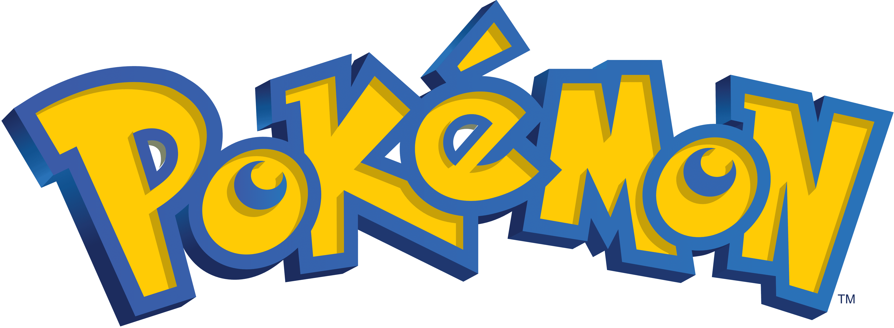

<!-- PROJECT LOGO -->
 

  

  <h3 align="center">Pokemon Sprite Poster</h3>

  

    Pokemon Sprites from Generation 1 through 5!
     
    <a href="https://pokemon-poster.com/">Live Demo</a>
    ·
    <a href="https://github.com/Ryan-Fingerhuth/pokemon-sprite-poster/issues">Report Bug</a>
    ·
    <a href="https://github.com/Ryan-Fingerhuth/pokemon-sprite-poster/issues">Request Feature</a>
  

<!-- TABLE OF CONTENTS -->

  
Table of Contents

  <ol>
    <li>
      <a href="#about-the-project">About The Project</a>
      <ul>
        <li><a href="#built-with">Built With</a></li>
      </ul>
    </li>
    <li><a href="#license">License</a></li>
    <li><a href="#contact">Contact</a></li>
    <li><a href="#acknowledgments">Acknowledgments</a></li>
  </ol>

<!-- ABOUT THE PROJECT -->
## About The Project

Growing up I loved looking at pokemon posters such as the one above.
Wanted to re-create a poster style layout site that showcases all the awesome pokemon sprites from Gen 1 through 5.

<b>Inspiration:</b>

  

## Built With

[![Angular][Angular.io]][Angular-url]
[![Bootstrap][Bootstrap.com]][Bootstrap-url]

<!-- LICENSE -->
## License

[![LICENSE][license-shield]][license-url]

Distributed under the MIT License. See `LICENSE.txt` for more information.

<!-- CONTACT -->
## Contact

Ryan Fingerhuth - rfingerhuth@gmail.com

[![LinkedIn][linkedin-shield]][linkedin-url]

Project Link: [https://github.com/Ryan-Fingerhuth/pokemon-sprite-poster](https://github.com/Ryan-Fingerhuth/pokemon-sprite-poster)

<!-- ACKNOWLEDGMENTS -->
## Acknowledgments

Use this space to list resources you find helpful and would like to give credit to. I've included a few of my favorites to kick things off!

* [Pokemon Sprite provided by Bulbagarden.net](https://archives.bulbagarden.net/)
* [Choose an Open Source License](https://choosealicense.com)
* [Img Shields](https://shields.io)

(<a href="#readme-top">back to top</a>)

<!-- MARKDOWN LINKS & IMAGES -->
[license-shield]: https://img.shields.io/github/license/othneildrew/Best-README-Template.svg?style=for-the-badge
[license-url]: LICENSE.txt
[linkedin-shield]: https://img.shields.io/badge/-LinkedIn-black.svg?style=for-the-badge&logo=linkedin&colorB=555
[linkedin-url]: https://www.linkedin.com/in/ryan-fingerhuth/
[Angular.io]: https://img.shields.io/badge/Angular-DD0031?style=for-the-badge&logo=angular&logoColor=white
[Angular-url]: https://angular.io/
[Bootstrap.com]: https://img.shields.io/badge/Bootstrap-563D7C?style=for-the-badge&logo=bootstrap&logoColor=white
[Bootstrap-url]: https://getbootstrap.com